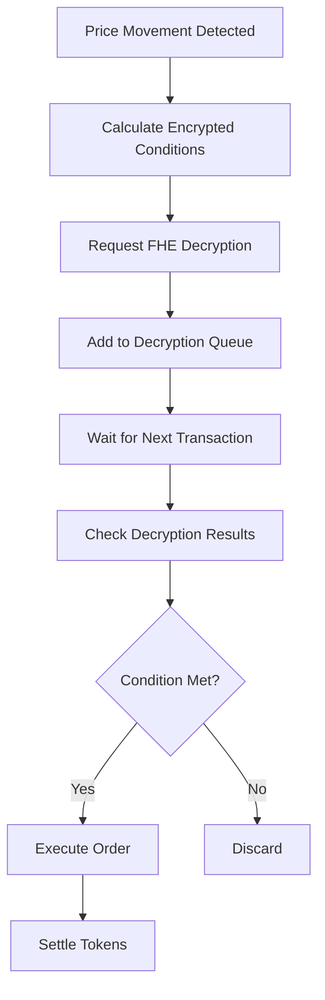
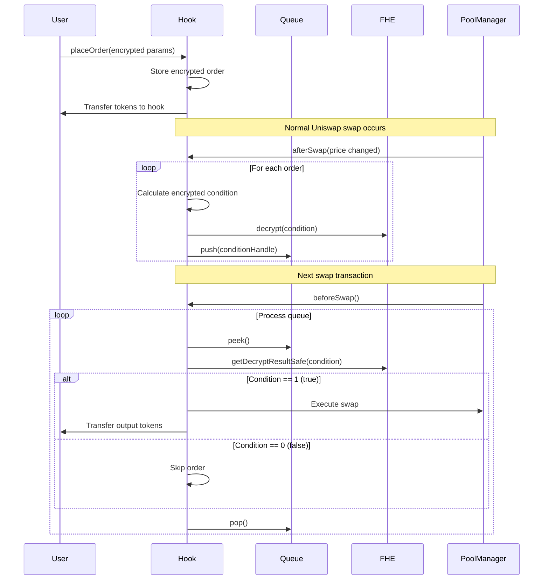

# FHE Private Limit Orders for Uniswap V4 Hook

## Table of Contents
1. [Architecture Overview](#architecture-overview)
2. [Key Components](#key-components)
3. [FHE Transformation Patterns](#fhe-transformation-patterns)
4. [Implementation Flow](#implementation-flow)
5. [Complete Contract Implementation](#complete-contract-implementation)
6. [Testing and Integration](#testing-and-integration)

---

## Architecture Overview

### Core Concept: Two-Phase Execution Pattern

Traditional limit orders execute immediately when conditions are met. With FHE, we need a **two-phase approach** due to asynchronous decryption:

```
Phase 1 (afterSwap):  Price Change → Evaluate Encrypted Conditions → Request Decryption → Queue Orders
Phase 2 (beforeSwap): Check Decrypted Results → Execute Valid Orders → Settle Tokens
```

### Privacy Benefits

| Component | Traditional (Public) | FHE (Private) | Benefit |
|-----------|---------------------|---------------|---------|
| Trigger Price | `int24 triggerTick` | `euint32 triggerTick` | Price targets hidden |
| Order Type | `OrderType orderType` | `ebool orderType` | Take profit vs stop loss hidden |
| Order Direction | `bool zeroForOne` | `bool zeroForOne` | Public - simplified for this implementation |
| Trade Amount | `uint256 amount` | `uint256 amount` | Public - for ERC20 compatibility |

---

## Key Components

### 1. Queue-Based Decryption System



### 2. Data Structures

```solidity
// Core order structure with encrypted fields
struct Order {
    address trader;
    euint32 triggerTick;           // Private trigger price
    bool zeroForOne;               // Public direction (simplified for current implementation)
    ebool orderType;               // Private type (true=TakeProfit, false=StopLoss)
    uint256 amount;                // Public amount (for ERC20 transfers)
    OrderStatus status;
    PoolId keyId;
}

// Metadata for decryption queue processing
struct OrderDecryptionInfo {
    uint256 orderId;
    int24 currentTick;
    bool priceIncreased;
}

// Queue management per pool
mapping(PoolId => Queue) private poolDecryptionQueues;
mapping(euint256 => OrderDecryptionInfo) private decryptionInfo;
```

### 3. FHE Access Control Pattern

```solidity
function _setupFHEAccess(euint32 triggerTick, ebool orderType) internal {
    // Contract access for future operations
    FHE.allowThis(triggerTick);
    FHE.allowThis(orderType);

    // User access for viewing their orders
    FHE.allowSender(triggerTick);
    FHE.allowSender(orderType);
}
```

---

## FHE Transformation Patterns

### Before: Traditional Boolean Logic

```solidity
bool shouldExecute = false;

if (order.orderType == OrderType.TakeProfit) {
    if (order.zeroForOne) {
        shouldExecute = priceIncreased && currentTick >= order.triggerTick;
    } else {
        shouldExecute = !priceIncreased && currentTick <= order.triggerTick;
    }
} else { // StopLoss
    if (order.zeroForOne) {
        shouldExecute = !priceIncreased && currentTick <= order.triggerTick;
    } else {
        shouldExecute = priceIncreased && currentTick >= order.triggerTick;
    }
}

if (shouldExecute) {
    executeOrder(key, orderId);
}
```

### After: FHE Encrypted Logic

```solidity
function _calculateExecutionCondition(Order memory order, int24 currentTick, bool priceIncreased)
    internal returns (euint128)
{
    // Convert plaintext to encrypted for comparison
    // Use TICK_OFFSET constant for consistent tick conversion
    euint32 currentTickEnc = FHE.asEuint32(uint32(int32(currentTick) + int32(TICK_OFFSET)));
    ebool priceIncreasedEnc = FHE.asEbool(priceIncreased);
    ebool zeroForOneEncrypted = FHE.asEbool(order.zeroForOne);


    // Take Profit conditions
    ebool takeProfitZeroForOne = FHE.and(
        priceIncreasedEnc,
        FHE.gte(currentTickEnc, order.triggerTick)
    );

    ebool takeProfitOneForZero = FHE.and(
        FHE.not(priceIncreasedEnc),
        FHE.lte(currentTickEnc, order.triggerTick)
    );

    ebool takeProfitCondition = FHE.select(
        zeroForOneEncrypted,
        takeProfitZeroForOne,
        takeProfitOneForZero
    );

    // Stop Loss conditions
    ebool stopLossZeroForOne = FHE.and(
        FHE.not(priceIncreasedEnc),
        FHE.lte(currentTickEnc, order.triggerTick)
    );

    ebool stopLossOneForZero = FHE.and(
        priceIncreasedEnc,
        FHE.gte(currentTickEnc, order.triggerTick)
    );

    ebool stopLossCondition = FHE.select(
        zeroForOneEncrypted,
        stopLossZeroForOne,
        stopLossOneForZero
    );

    // Select between TakeProfit and StopLoss
    ebool shouldExecute = FHE.select(
        order.orderType,
        takeProfitCondition,
        stopLossCondition
    );

    // Convert to euint128 for decryption
    euint128 result = FHE.asEuint128(shouldExecute);
    FHE.allowThis(result);

    return result;
}
```

---

## Implementation Flow

### Flow Diagram



### Transaction Sequence

1. **Order Placement Transaction**
   - User submits encrypted parameters
   - Hook stores order with proper FHE access control
   - Tokens transferred to hook contract

2. **Trigger Detection Transaction** (afterSwap)
   - Price movement detected
   - Calculate encrypted execution conditions
   - Request FHE decryption for potential triggers
   - Add to decryption queue

3. **Order Execution Transaction** (beforeSwap)
   - Check decrypted results from queue
   - Execute valid orders
   - Settle tokens with pool manager
   - Transfer output tokens to users

---

## Testing and Integration

### Required Test Cases

1. **Order Placement Tests**
   - Valid encrypted parameters
   - Access control verification
   - Token transfer validation

2. **Trigger Detection Tests**
   - Price increase scenarios
   - Price decrease scenarios
   - Multiple order types simultaneously

3. **Decryption Queue Tests**
   - Queue management under load
   - Partial decryption scenarios
   - Queue overflow handling

4. **Execution Tests**
   - Successful order execution
   - Failed execution handling
   - Token settlement verification

### Integration Checklist

- [ ] Deploy Queue contract
- [ ] Configure FHE access patterns
- [ ] Test with Fhenix testnet
- [ ] Integrate with Uniswap V4 testnet
- [ ] Front-end integration with cofhejs
- [ ] Gas optimization analysis


## Future Enhancements

### Phase 2 Roadmap

1. **Full FHE Token Integration**
   - Replace public amounts with encrypted amounts
   - Integrate FHEERC20 tokens
   - Support ETH/WETH handling

2. **Advanced Order Types**
   - Trailing stop losses
   - Conditional orders
   - Time-based orders

3. **Cross-Chain Support**
   - Cross-chain execution
   - Unified liquidity

4. **MEV Protection**
   - Order randomization

This architecture provides a solid foundation for private limit orders while maintaining compatibility with existing Uniswap V4 infrastructure and ERC20 tokens.
