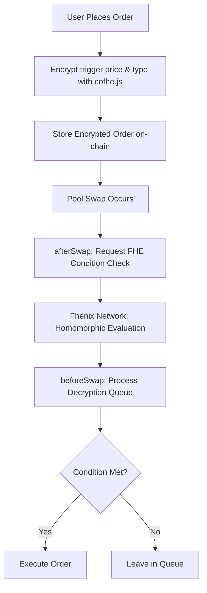

# Susanoo(Janus): Encrypted Limit Order Hook for Uniswap V4


## 🏆 Overview

Susanoo(Janus) is a groundbreaking Uniswap V4 hook that implements fully private limit orders using Fully Homomorphic Encryption (FHE). This revolutionary approach allows traders to place take-profit and stop-loss orders without revealing their strategies to the network, solving one of DeFi's most persistent problems: MEV exploitation through strategy visibility.

**Problem Solved**: Traditional limit orders on chain would need their prices and logic directly on chain hereby reducing trade alpha and exposing degen traders to MEV.

**Key Innovation**: First implementation of encrypted conditional trading logic that executes only when hidden conditions are met, without ever exposing those conditions to the public blockchain.


## 🔐 Partner Integration

### Fhenix Network

**Core Technology Provider**: Susanoo is built on Fhenix's FHE co-processor technology, enabling:

- Encrypted trigger price storage (`euint32 triggerTick`)
- Private order type specification (`ebool orderType`)
- Homomorphic computation of trading conditions
- Asynchronous threshold decryption of execution signals

#### Integration Points

| Component | Purpose | Implementation |
|-----------|---------|----------------|
| `FHE.sol` library | All encrypted operations | Core encryption primitives |
| Threshold decryption network | Order execution validation | Fhenix co-processor |
| Encrypted state management | Hook lifecycle persistence | On-chain encrypted storage |
| `cofhe.js` integration | Client-side encryption | Frontend order creation |

## 🎯 Problem Being Solved

Traditional limit orders on AMMs suffer from transparency-induced MEV:

- ❌ Front-running of stop-loss and take-profit orders
- ❌ Strategy extraction from visible order books
- ❌ Price manipulation around known liquidity points
- ❌ Information asymmetry favoring sophisticated bots

Susanoo solves this by keeping all critical order parameters encrypted until execution:

- ✅ Encrypted trigger prices
- ✅ Hidden order types (stop-loss/take-profit)
- ✅ Private execution logic
- ✅ Visible only to the order placer

## ✨ How It Works

### Architecture Overview



### Technical Implementation

#### Encrypted Order Structure

```solidity
struct Order {
    address trader;
    bool zeroForOne;
    OrderStatus status;
    ebool orderType;     // Encrypted: true = TakeProfit, false = StopLoss
    euint32 triggerTick; // Encrypted trigger price
    uint256 amount;
    PoolId keyId;
}
```

#### FHE-Powered Execution Flow

1. **Order Placement**: User encrypts trigger parameters off-chain using Fhenix's `cofhe.js`
2. **Condition Monitoring**: Pool swaps trigger homomorphic evaluation of encrypted conditions
3. **Threshold Decryption**: Fhenix network computes whether to execute without revealing why
4. **Atomic Execution**: Verified orders execute in next swap with full slippage protection

## 🚀 Unique Value Proposition

### Originality

- First FHE-based limit order hook in Uniswap ecosystem
- Novel encrypted condition paradigm - conditions remain hidden even during evaluation
- Zero-strategy-leakage design - completely new approach to AMM order types

### Unique Execution 

- Dual-phase decryption system: Condition checking → Amount execution
- Tick offset encryption scheme: Adapts FHE to Uniswap V3/V4 tick system
- Asynchronous yet atomic execution: Maintains Uniswap safety guarantees
- Gas-optimized queue processing: Efficient FHE operation batching

### Impact

- Democratizes trading strategies: Retail traders protected from MEV and trade alpha is preserved.
- Enables institutional DeFi: Large orders without signaling risk
- Protects liquidity providers: Prevents predatory trading around known liquidity
- Advances privacy-preserving DeFi: Sets new standard for on-chain privacy

## 🔧 Technical Deep Dive

### Key Innovations

#### 1. Homomorphic Condition Evaluation

```solidity
function _calculateExecutionCondition(Order memory order, int24 currentTick, bool priceIncreased)
    private
    returns (euint128)
{
    // All operations occur on encrypted data
    ebool takeProfitCondition = FHE.and(priceIncreasedEnc, FHE.gte(currentTickEnc, triggerTick));
    ebool stopLossCondition = FHE.and(FHE.not(priceIncreasedEnc), FHE.lte(currentTickEnc, triggerTick));
    return FHE.asEuint128(FHE.select(orderType, takeProfitCondition, stopLossCondition));
}
```

#### 2. Asynchronous Execution Pipeline

| Phase | Hook | Action |
|-------|------|--------|
| Condition Check | `afterSwap` | Request FHE network evaluation |
| Result Processing | `beforeSwap` | Process decrypted results |
| Safety | Both | Atomic revert protection maintains safety |

#### 3. Tick Encryption Scheme

- Transforms negative ticks to unsigned range for FHE compatibility
- Maintains full Uniswap V3/V4 price precision
- Zero precision loss in encryption/decryption process

## 📊 Performance Characteristics

| Metric | Value | Note |
|--------|-------|------|
| Gas Overhead per Order | ~15-20% | Mainly FHE operations |
| Decryption Time | 1-2 blocks | Fhenix network latency |
| Maximum Orders per Swap | Limited by gas | Queue processing efficiency |
| Privacy Level | Complete | Zero strategy leakage |

## 🛠 Installation & Usage

### Prerequisites

- Node.js 16+
- Foundry
- Fhenix `cofhe.js`
- Access to Fhenix testnet

### Quick Start

```bash
# Clone the repository
git clone https://github.com/your-org/susanoo.git
cd susanoo

# Install dependencies
npm install
forge install

# Build contracts
forge build

# Run tests
forge test -vvv
```

## 🚀 Deployment Guide

### Local Anvil Deployment

1. **Start Anvil**
   ```bash
   anvil
   ```

2. **Deploy to Local Anvil**
   ```bash
   forge script script/Anvil.s.sol --broadcast --private-key <YOUR_PRIVATE_KEY>
   ```

   This will deploy the complete Susanoo ecosystem and output the contract addresses. Example output:
   ```
   Currency currency0 = Currency.wrap(0x95401dc811bb5740090279Ba06cfA8fcF6113778);
   Currency currency1 = Currency.wrap(0x998abeb3E57409262aE5b751f60747921B33613E);
   Pool initialized
   Liquidity added

   Susanoo ecosystem deployed successfully!

   Update Config.sol with these addresses:
   PoolManager poolManager = IPoolManager(0x84eA74d481Ee0A5332c457a4d796187F6Ba67fEB);
   IHooks hookContract = IHooks(0x303C5560eb3229fe2b73f920513aDAAaba1a90c0);
   IPositionManager posm = IPositionManager(0xa82fF9aFd8f496c3d6ac40E2a0F282E47488CFc9);

   Router addresses for scripts:
   PoolSwapTest swapRouter = PoolSwapTest(0x851356ae760d987E095750cCeb3bC6014560891C);
   ```

3. **Update Configuration**

   Copy the output addresses to your `script/base/Config.sol` file for future interactions.

### Testnet Deployment

1. **Set Environment Variables**
   ```bash
   export RPC_URL="your_testnet_rpc_url"
   export PRIVATE_KEY="your_private_key"
   ```

2. **Deploy to Testnet**
   ```bash
   forge script script/TestnetDeploy.s.sol --rpc-url $RPC_URL --private-key $PRIVATE_KEY --broadcast
   ```

3. **Save Configuration**

   Update your `script/base/Config.sol` file with the deployed addresses for future testnet interactions.

### Verification

After deployment, verify your contracts are working by:

1. Checking the deployed hook contract has the correct permissions
2. Placing a test order to ensure the encryption and queue system works
3. Performing a swap to trigger order evaluation

## 🖥 Frontend Setup

### Prerequisites

- Node.js 16+
- Access to Arbitrum Sepolia testnet

### Running the Frontend

1. **Navigate to the client directory**
   ```bash
   cd client
   ```

2. **Set up environment variables**

   Create a `.env` file in the `client` directory with the following variables:
   ```bash
   VITE_PRIVATE_KEY=your_private_key_here
   VITE_PROVIDER_RPC_URL=https://sepolia-rollup.arbitrum.io/rpc
   ```

   **Note**: The RPC URL should point to Arbitrum Sepolia as that's where the contracts are deployed.

3. **Install dependencies and start the development server**
   ```bash
   npm install
   npm run dev
   ```

4. **Access the application**

   The frontend will be available at `http://localhost:5173` (or the port shown in your terminal).

## 📍 Deployment Addresses

### Arbitrum Sepolia Testnet

| Contract | Address | Explorer |
|----------|---------|----------|
| Susanoo Hook | `0x569b28A558D1229E172E77202D580052179d10c0` | [View on Arbiscan](https://sepolia.arbiscan.io/address/0x569b28a558d1229e172e77202d580052179d10c0) |

### Order Placement Example

```javascript
import { createOrder } from './utils/orderCreation.js';
import { FHE } from 'cofhe.js';

// Create encrypted order
const encryptedOrder = await createOrder({
    triggerTick: -100,      // Will be encrypted
    orderType: 'takeProfit', // Will be encrypted as ebool
    amount: '1000000000000000000', // 1 ETH worth
    tokenPair: 'ETH/MEME'
});

// Submit to contract
await susanooContract.placeOrder(
    poolKey,
    false, // zeroForOne
    encryptedOrder.triggerTick,
    encryptedOrder.orderType,
    encryptedOrder.amount
);
```


### Test Coverage

| Test Category | Description |
|---------------|-------------|
| Order Placement | Encrypted order creation and validation |
| Execution Logic | Take profit and stop loss condition testing |
| Privacy Verification | Ensuring encrypted values match expected |
| Edge Cases | Boundary conditions and error handling |

## 🔮 Future Enhancements

- [ ] Support for multiple asset pairs
- [ ] Advanced order types (trailing stops, OCO orders)
- [ ] Integration with additional FHE providers
- [ ] Gas optimization through batch processing
- [ ] Mobile-first trading interface

## 📄 License

This project is licensed under the MIT License - see the [LICENSE](LICENSE) file for details.

## 🤝 Contributing

We welcome contributions! Please see our [Contributing Guidelines](CONTRIBUTING.md) for details.

## 🔗 Links

- [Fhenix Network](https://fhenix.io)
- [Uniswap V4 Documentation](https://docs.uniswap.org/contracts/v4/overview)
- [Live Demo](https://lucky-toffee-a797fa.netlify.app)

---

*Built with ❤️ for the future of private DeFi*
